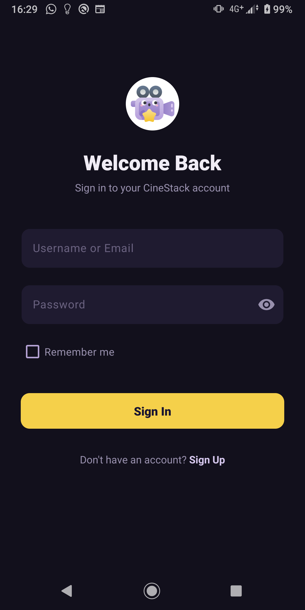
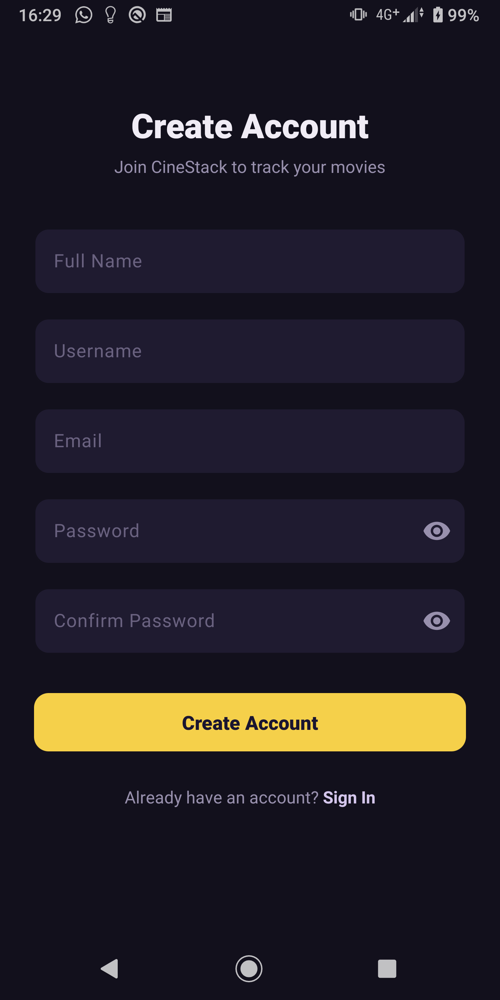
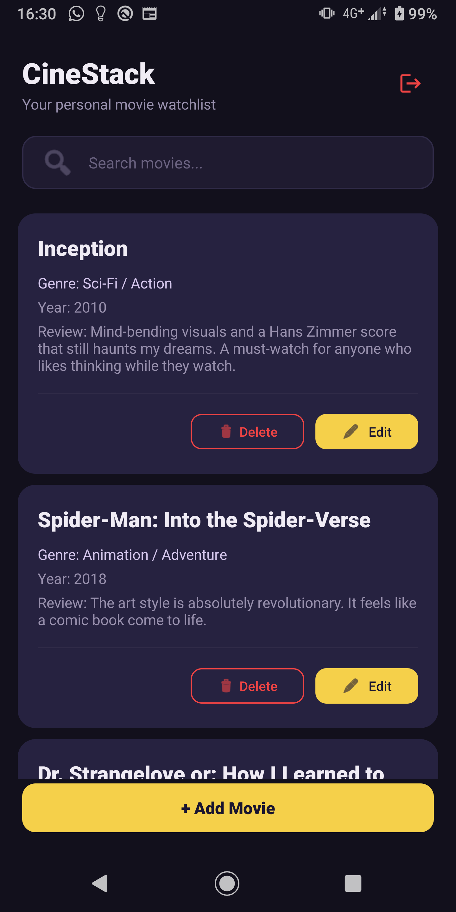
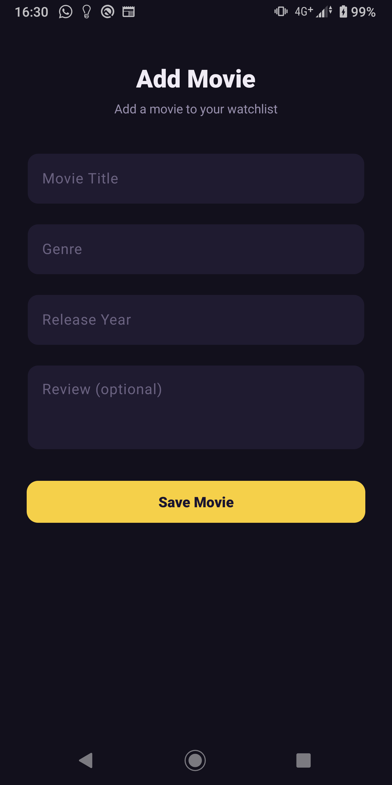

# 🎬 CineStack - Movie Watchlist & Review App

<div align="center">


**ICT3214 – Mobile Application Development**  
**Department of Computing - Faculty of Applied Sciences**  
**Rajarata University of Sri Lanka**


</div>

---

## 📋 Table of Contents

- [About the Project](#-about-the-project)
- [Group Members](#-group-members)
- [Features](#-features)
- [Technologies & Constraints](#-technologies--constraints)
- [Project Structure](#-project-structure)
- [Database Schema](#-database-schema)
- [Security Implementation](#-security-implementation)
- [Application Flow](#-application-flow)
- [Individual Contributions](#-individual-contributions)
- [Installation & Setup](#-installation--setup)
- [Screenshots](#-screenshots)
- [Academic Information](#-academic-information)

---

## 📖 About the Project

**CineStack** is a native Android application developed as the group project for the module **ICT3214 – Mobile Application Development** (Year 3, Semester 1).

The app allows registered users to maintain a personal **movie watchlist**, add movies they have watched, write **short reviews**, and **search** through their collection. It features a complete **login and registration system** with secure password hashing, persistent sessions, and a modern dark-themed Material Design UI.

> **Project Category:** 9. Movie Watchlist & Review App - *Focus: Entertainment preferences*

---

## 👥 Group Members

| # | Name | Index No. | Registration No. |
|---|------|-----------|-------------------|
| 1 | R P I P P Gotabhaya | 5664 | ICT/2022/058 |
| 2 | P.G.P.W. Gunathilake | 5662 | ICT/2022/056 |

**Batch:** 21/22  
**Academic Year:** 2026

---

## ✅ Features

### User Authentication
- Secure **registration** with full input validation
- **Login** using username or email
- **SHA-256 password hashing** - passwords are never stored in plain text
- **"Remember Me"** checkbox — controls auto-login on next app launch
- **Auto-login** for returning users when Remember Me is enabled
- **Logout** button on the main screen header

### Movie Watchlist (CRUD)
- **Add** movies with title, genre, year, and review
- **View** personal watchlist in a scrollable RecyclerView
- **Edit** movie details (title, genre, year, review)
- **Delete** movies from the watchlist

### Search
- **Real-time search** by movie title using SQLite `LIKE` query
- Instant filtering as the user types

### UI / UX
- Modern **dark theme** with indigo/violet accent palette
- **Material Design 3** components (TextInputLayout, MaterialButton, MaterialCardView)
- Custom vector drawables and clean minimalist design
- Responsive XML layouts with proper input validation feedback

---

## 🛠 Technologies & Constraints

The project strictly follows the module guidelines:

| Requirement | Implementation |
|-------------|----------------|
| Language | **Java** (no Kotlin) |
| UI | **XML Layouts** (no Jetpack Compose) |
| Database | **SQLiteOpenHelper** (no Room, no Firebase) |
| Session | **SharedPreferences** |
| Security | **SHA-256** password hashing |
| Architecture | Simple activity-based (no MVVM) |
| Min SDK | 24 (Android 7.0) |
| Target SDK | 36 |

### Dependencies
- `com.google.android.material:material:1.12.0` - Material Design components
- `androidx.appcompat` - backward-compatible AppCompat
- `androidx.recyclerview` - RecyclerView for movie list
- `androidx.constraintlayout` - flexible layouts

---

## 📂 Project Structure

```
app/src/main/
├── java/com/example/cinestack/
│   ├── DatabaseHelper.java        # SQLite database (Users + Movies tables)
│   ├── SessionManager.java        # Login session handling (SharedPreferences)
│   ├── LoginActivity.java         # User login screen & authentication
│   ├── RegisterActivity.java      # User registration with validation
│   ├── MainActivity.java          # Movie watchlist (RecyclerView + search)
│   ├── AddMovieActivity.java      # Add new movie form
│   ├── EditMovieActivity.java     # Edit existing movie details
│   ├── Movie.java                 # Movie data model (POJO)
│   └── MovieAdapter.java          # RecyclerView adapter for movie cards
│
├── res/layout/
│   ├── activity_login.xml         # Login screen layout
│   ├── activity_register.xml      # Registration screen layout
│   ├── activity_main.xml          # Main watchlist screen layout
│   ├── activity_add_movie.xml     # Add movie form layout
│   ├── activity_edit_movie.xml    # Edit movie form layout
│   └── item_movie.xml             # Movie card item for RecyclerView
│
├── res/drawable/
│   ├── bg_search.xml              # Search bar background shape
│   └── ic_logout.xml              # Logout vector icon
│
├── res/menu/
│   └── menu_main.xml             # Options menu
├── res/values/
│   ├── colors.xml                # App color palette
│   └── ids.xml                   # View ID declarations
│
└── AndroidManifest.xml            # Activity declarations & launcher config
```

---

## 🗄 Database Schema

**Database Name:** `CineStack.db`  
**Database Version:** 3

### Users Table

| Column | Type | Constraints | Description |
|--------|------|-------------|-------------|
| `id` | INTEGER | PRIMARY KEY, AUTOINCREMENT | Unique user identifier |
| `username` | TEXT | NOT NULL, UNIQUE | Login username (stored lowercase) |
| `email` | TEXT | NOT NULL, UNIQUE | User email address (stored lowercase) |
| `password` | TEXT | NOT NULL | SHA-256 hashed password |
| `full_name` | TEXT | NOT NULL | User's display name |
| `created_at` | TEXT | NOT NULL | Registration timestamp |

### Movies Table

| Column | Type | Constraints | Description |
|--------|------|-------------|-------------|
| `movie_id` | INTEGER | PRIMARY KEY, AUTOINCREMENT | Unique movie identifier |
| `title` | TEXT | NOT NULL | Movie title |
| `genre` | TEXT | NOT NULL | Movie genre |
| `year` | INTEGER | NOT NULL | Release year |
| `review` | TEXT | - | User's short review |
| `user_id` | INTEGER | NOT NULL, FOREIGN KEY | References `users(id)` ON DELETE CASCADE |

### Entity Relationship

```
┌──────────┐        ┌──────────┐
│  USERS   │ 1────M │  MOVIES  │
│──────────│        │──────────│
│ id (PK)  │◄───────│ user_id  │
│ username │        │ movie_id │
│ email    │        │ title    │
│ password │        │ genre    │
│ full_name│        │ year     │
│ created  │        │ review   │
└──────────┘        └──────────┘
```

---

## 🔐 Security Implementation

| Feature | Details |
|---------|---------|
| **Password Hashing** | SHA-256 via `java.security.MessageDigest` - passwords are hashed before storage and compared as hashes during login |
| **SQL Injection Prevention** | All queries use parameterized placeholders (`?`) with `rawQuery()` / `ContentValues` |
| **Input Validation** | Client-side validation for empty fields, email format, password length (≥ 6), username format (alphanumeric + underscore), and password confirmation match |
| **Unique Constraints** | Database enforces `UNIQUE` on both `username` and `email` columns |
| **Session Management** | `SessionManager` class wraps SharedPreferences under `CineStackSession` — stores login state, username, full name, user ID, and remember-me preference |
| **Session Security** | Session is checked on app launch; unauthorized users are redirected to login; logout clears all session data; without Remember Me, session is cleared on next app restart |

---

## 🔄 Application Flow

```
App Launch
    │
    ▼
SessionManager.isLoggedIn() && rememberMe?
    │
    ├── YES ──► MainActivity (Watchlist)
    │               │
    │               ├── View movies (RecyclerView)
    │               ├── Search movies (real-time)
    │               ├── Add Movie ──► AddMovieActivity
    │               ├── Edit Movie ──► EditMovieActivity
    │               ├── Delete Movie
    │               └── Logout (header button) ──► LoginActivity
    │
    └── NO ───► LoginActivity
                    │
                    ├── Login (username/email + password)
                    │       └── SHA-256 hash → compare with DB
                    │
                    └── Register ──► RegisterActivity
                            └── Validate → Hash password → Insert to DB
```

---

## 🧑‍💻 Individual Contributions

### R P I P P Gotabhaya - Index No: 5664

| # | Task | Files |
|---|------|-------|
| 1 | Database schema design (Users & Movies tables) | `DatabaseHelper.java` |
| 2 | SQLiteOpenHelper implementation | `DatabaseHelper.java` |
| 3 | User registration system with input validation | `RegisterActivity.java`, `activity_register.xml` |
| 4 | Secure password hashing (SHA-256) | `DatabaseHelper.java` |
| 5 | Login system with username/email authentication | `LoginActivity.java`, `activity_login.xml` |
| 6 | Session management (SharedPreferences) | `SessionManager.java` |
| 7 | Auto-login & "Remember Me" functionality | `LoginActivity.java`, `SessionManager.java` |
| 8 | Modern dark theme UI overhaul & Material3 design | All layouts, drawables, `colors.xml`, `themes.xml` |
| 9 | Logout button on main screen | `MainActivity.java`, `activity_main.xml`, `ic_logout.xml` |

### P.G.P.W. Gunathilake - Index No: 5662

| # | Task | Files |
|---|------|-------|
| 1 | Add Movie functionality | `AddMovieActivity.java`, `activity_add_movie.xml` |
| 2 | Edit Movie functionality | `EditMovieActivity.java`, `activity_edit_movie.xml` |
| 3 | Delete Movie functionality | `MovieAdapter.java` |
| 4 | RecyclerView implementation for movie list | `MovieAdapter.java`, `Movie.java`, `item_movie.xml` |
| 5 | Movie search (SQLite LIKE query) | `MainActivity.java`, `DatabaseHelper.java` |
| 6 | UI/UX design - original layouts & drawables | All layout XMLs, drawable resources |
| 7 | Main screen layout & navigation | `activity_main.xml`, `menu_main.xml` |

---

## 🚀 Installation & Setup

### Prerequisites

- Android Studio (Arctic Fox or later)
- Android SDK (API Level 24+)
- Java Development Kit (JDK 11+)

### Steps

1. **Clone the repository:**
   ```bash
   git clone https://github.com/sh13y/CineStack.git
   ```

2. **Open** the project in Android Studio.

3. **Sync** Gradle files (Android Studio will prompt automatically).

4. **Run** on an emulator or physical device (min API 24).

### Building APK

```bash
./gradlew assembleDebug
```

APK output: `app/build/outputs/apk/debug/app-debug.apk`

---

## 📸 Screenshots

| Sign In | Sign Up | Home | Add Movie |
|---------|---------|------|-----------|
|  |  |  |  |

---

## 🎓 Academic Information

| Field | Details |
|-------|---------|
| **Module Code** | ICT3214 |
| **Module Name** | Mobile Application Development |
| **Project Type** | Group Project |
| **Batch** | 21/22 |
| **Semester** | Year 3, Semester 1 |
| **Academic Year** | 2026 |
| **University** | Rajarata University of Sri Lanka |
| **Faculty** | Faculty of Applied Sciences |
| **Department** | Department of Computing |

---

## 📄 License

This project is developed for academic purposes at the Department of Computing, Faculty of Applied Sciences, Rajarata University of Sri Lanka. It is part of the coursework for ICT3214 - Mobile Application Development.

---

## 🔗 Links

- [GitHub Repository](https://github.com/sh13y/CineStack)
- [Pull Requests](https://github.com/sh13y/CineStack/pulls)
- [Issue Tracker](https://github.com/sh13y/CineStack/issues)

---

<div align="center">

**CineStack** - Built with ☕ Java & 🎬 Passion  
*ICT3214 Group Project - Rajarata University of Sri Lanka*

</div>
